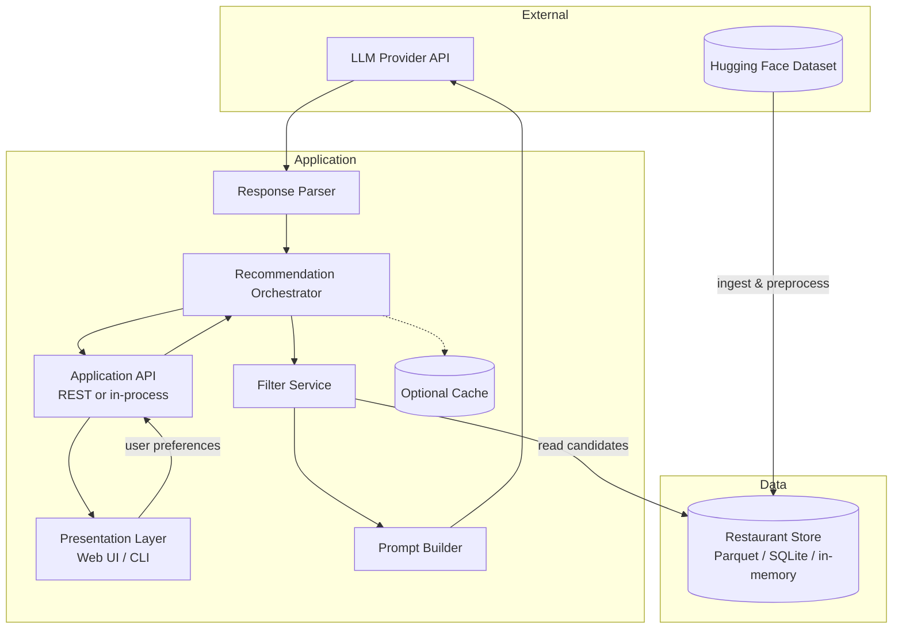
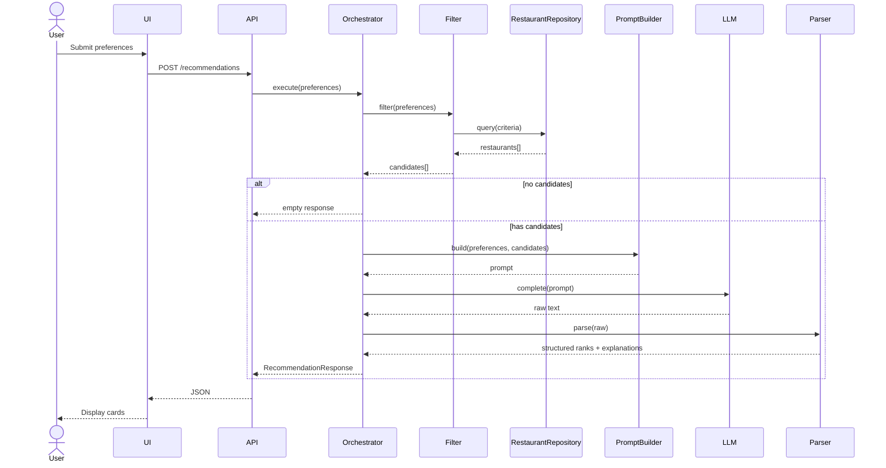

# Technical Architecture: AI-Powered Restaurant Recommendation System

This document describes the technical architecture for the Zomato-inspired restaurant recommendation service. It is derived from [context.md](file:///c:/Nextleap%20Projects%20Git/ZomatoFirstProject/docs/context.md) and defines components, data flows, interfaces, and implementation guidance for a greenfield build.

---

## Goals and Constraints

### Primary Goals

| Goal | Description |
| :--- | :--- |
| **Personalization** | Recommendations reflect location, budget, cuisine, rating, and free-text preferences. |
| **Explainability** | Each result includes a customized, LLM-generated rationale explaining *why* it fits. |
| **Grounding** | Suggestions must come exclusively from the real Zomato dataset—zero hallucinated venues. |
| **Usability** | Clear input form and highly scannable output grid showing name, rating, cost, and rationale. |

### Architectural Constraints

* **Filter before generate:** Apply deterministic filters on structured data (Location, Cuisine, Cost, and Rating) before calling the LLM to control cost, latency, and hallucination risk.
* **Bounded context:** Pass only a capped set of candidate restaurants into the prompt (e.g., top 20–30 after filtering).
* **Structured + generative:** Dataset fields are the source of truth; the LLM ranks and explains within that candidate set.
* **Single-tenant MVP:** No multi-user authentication required for the initial milestone; design modularly to allow adding it later.

### Out of Scope (Initial Milestone)
* User accounts, saved favorites, or order placement.
* Real-time restaurant availability or live Zomato API integration.
* Fine-tuned custom models (use hosted Groq APIs).
* Geographic routing or map visualization.

---

## High-Level Architecture

The system follows a pipeline architecture: ingest once (or on schedule), serve many recommendation requests through **filter $\rightarrow$ prompt $\rightarrow$ LLM $\rightarrow$ render**.



### Architecture Style

| Aspect | Choice | Rationale |
| :--- | :--- | :--- |
| **Style** | Layered pipeline + orchestrator | Matches context workflow; easy to test each stage in isolation. |
| **Coupling** | Orchestrator coordinates services | Direct UI $\rightarrow$ LLM is forbidden; clean boundaries make it simple to swap providers. |
| **State** | Stateless request handling | Restaurant data is queried from a local, high-performance read-only store. |
| **Sync vs Async** | Synchronous | Synchronous for MVP; async job queue is optional and out-of-scope for the first milestone. |

---

## Logical Layers

```
┌────────────────────────────────────────────────────────────────────────────┐
│                        PRESENTATION LAYER                                  │
│  Forms (location, budget, cuisine, rating, extras) · Results cards/list   │
└────────────────────────────────────────────────────────────────────────────┘
                                      │
                                      ▼
┌────────────────────────────────────────────────────────────────────────────┐
│                        APPLICATION / API LAYER                             │
│  Validate input · Map DTOs · Invoke orchestrator · Return JSON/view models │
└────────────────────────────────────────────────────────────────────────────┘
                                      │
                                      ▼
┌────────────────────────────────────────────────────────────────────────────┐
│                        DOMAIN / ORCHESTRATION LAYER                        │
│  RecommendationOrchestrator: filter → build prompt → LLM → parse → rank   │
└────────────────────────────────────────────────────────────────────────────┘
                                      │
                    ┌─────────────────┼─────────────────┐
                    ▼                 ▼                 ▼
┌──────────────────────┐ ┌──────────────────┐ ┌────────────────────────────┐
│   DATA ACCESS LAYER  │ │  INTEGRATION     │ │  RECOMMENDATION ENGINE     │
│   Restaurant repo    │ │  Prompt builder  │ │  LLM client + parser       │
│   Filter queries     │ │  Template mgmt   │ │  Ranking instructions      │
└──────────────────────┘ └──────────────────┘ └────────────────────────────┘
                    │
                    ▼
┌────────────────────────────────────────────────────────────────────────────┐
│                        DATA INGESTION LAYER (offline / startup)            │
│  Hugging Face loader · normalize · persist · index                         │
└────────────────────────────────────────────────────────────────────────────┘
```

---

## Component Design

### 1. Data Ingestion Pipeline
**Responsibility:** Load the Zomato dataset from Hugging Face, normalize the schema, and persist for fast filtering.

* **`DatasetLoader`:** Fetch dataset via the Hugging Face `datasets` library or caching API.
* **`SchemaNormalizer`:** Map raw columns dynamically to a canonical `Restaurant` model.
* **`Preprocessor`:** Clean null values, normalize location strings, parse cuisines into structured lists, and classify cost into budget bands (`low`, `medium`, `high`) via configurable thresholds.
* **`PersistenceWriter`:** Write records to an optimized Parquet file or local SQLite database.

#### Normalization Mapping Rules:
* **Restaurant name:** `name: str` (Trim whitespace, deduplicate).
* **City / locality:** `location: str` (Enforce lowercase indexing for case-insensitive matching).
* **Cuisines:** `cuisines: list[str]` (Split comma-separated arrays and convert to lowercase).
* **Cost for two:** `estimated_cost: float` (Enrich to `budget_band` low/medium/high thresholds).
* **Aggregate rating:** `rating: float` (Enforce numeric parsing, defaults to `0.0`).

---

### 2. Restaurant Store & Repository
**Responsibility:** Abstract read-only access to preprocessed restaurant records.

```
RestaurantRepository
├── get_all() -> list[Restaurant]
├── filter(criteria: FilterCriteria) -> list[Restaurant]
└── get_by_ids(ids: list[str]) -> list[Restaurant]
```

#### Deterministic Filters:
* **location:** Exact match or substring matching on city/locality.
* **budget:** Strict filtering on mapped `budget_band`.
* **cuisine:** Case-insensitive search on cuisines array.
* **min_rating:** Boundary rating check (`rating >= min_rating`).
* **additional_preferences:** forward directly to the LLM (no structural filter).

**Post-filter ranking (pre-LLM):** Sort the matches by rating descending, and cap candidates at `MAX_CANDIDATES = 30` to prevent token bloat.

---

### 3. User Input Module
**Responsibility:** Collect and validate preferences at the presentation boundary.

```yaml
# Conceptual Schema
UserPreferences:
  location: str                          # required
  budget: Literal["low", "medium", "high"] # required
  cuisine: str                           # required
  min_rating: float                      # required (range: 0.0 - 5.0)
  additional_preferences: str | None     # optional free-text
  top_k: int = 5                         # default count
```

---

### 4. Filter Service
**Responsibility:** Execute deterministic pre-filtering and return bounded candidate pools.

```
FilterService.filter(preferences, repository) -> FilterResult
  ├── candidates: list[Restaurant]
  ├── total_before_cap: int
  └── applied_filters: dict
```

#### Edge Cases Handling:
* **Zero matches:** Proactively short-circuit execution. Return empty lists immediately and bypass the external LLM call.
* **Too many matches:** Pre-sort candidates descending by rating, and slice to maximum bounds.

---

### 5. Integration Layer (Prompt Builder)
**Responsibility:** Turn `UserPreferences` and candidates into a single LLM prompt with strict grounding.

* **System message:** Assigns the expert role, and defines grounding rules ("Only select from this list using `restaurant_id`. Do not invent details.").
* **User context:** Inserts user preferences and subjective free-text keywords.
* **Candidate block:** Formats the bounded restaurant list as a compact JSON block.
* **Output format instruction:** Forces output as a structured JSON object:

```json
{
  "summary": "General summary of the selection for this user.",
  "recommendations": [
    {
      "id": "restaurant_id",
      "rank": 1,
      "explanation": "Custom natural language rationale explaining why this spot fits their subjective preference."
    }
  ]
}
```

---

### 6. Recommendation Engine (LLM Client)
**Responsibility:** Wrap external provider connections, perform retries, parse JSON outputs, and join recommendation entities.

* **`LLMClient`:** Thin wrapper over Groq API.
* **`ResponseParser`:** Regex-based JSON block extractor with Pydantic validation.
* **`RecommendationMerger`:** Merges LLM rationale text with canonical database fields.

---

### 7. Recommendation Orchestrator
**Responsibility:** Single entry point and controller logic for the recommendation use case.

```
RecommendRestaurantsUseCase.execute(preferences) -> RecommendationResponse
```
1. Validate preferences schema.
2. Query pre-filtered candidate pool from the repository.
3. If empty, short-circuit and return an empty state payload.
4. Compile system instructions and user prompts.
5. Invoke external LLM client with timeout wrappers.
6. Parse raw output string and validate ID mapping.
7. Merge LLM rankings with canonical database records.
8. Deliver structured `RecommendationResponse`.

---

## Data Architecture

### Canonical Domain Model

```python
from pydantic import BaseModel
from typing import List, Optional, Dict

class Restaurant(BaseModel):
    id: str
    name: str
    location: str
    cuisines: List[str]
    rating: float
    estimated_cost: float
    budget_band: str  # "low" | "medium" | "high"
    metadata: Optional[Dict] = None

class UserPreferences(BaseModel):
    location: str
    budget: str
    cuisine: str
    min_rating: float
    additional_preferences: Optional[str] = None
    top_k: int = 5

class Recommendation(BaseModel):
    restaurant: Restaurant
    rank: int
    explanation: str

class RecommendationResponse(BaseModel):
    summary: Optional[str] = None
    recommendations: List[Recommendation]
```

### Dataset Ingestion Source
* **Provider:** Hugging Face
* **Name:** `ManikaSaini/zomato-restaurant-recommendation`
* **URL:** [zomato-restaurant-recommendation on HF](https://huggingface.co/datasets/ManikaSaini/zomato-restaurant-recommendation)

> [!WARNING]
> Ingestion must inspect the actual dataset's column headers on the first load in the `SchemaNormalizer` to dynamically map them—do not hardcode assuming rigid names without verification checks.

---

## Request Lifecycle

The request execution pipeline follows this sequence layout:



### Latency Budget (Target Budgets)

* **Filter + DB read:** $< 100\text{ ms}$ (in-memory Parquet load)
* **LLM Completion Call:** $2.0 - 15.0\text{ s}$ (provider/network roundtrip)
* **Response Parsing & Verification:** $< 50\text{ ms}$
* **End-to-End Budget:** Heavily dominated by the LLM call; UI must show active load Spinners.

---

## LLM Integration Architecture

### Prompting Principles
* **Grounding:** Explicitly instruct the model to only rank candidate restaurant IDs. Mismatched IDs will be discarded.
* **Low temperature:** Enforce `0.2 - 0.5` temperature thresholds for structured, high-stability rankings.
* **Cost Control:** Capping candidate inputs to keep token overhead low and response windows narrow.

### Failure Handling Strategies

| Failure | Mitigation Strategy |
| :--- | :--- |
| **API Timeout** | Implement an 8-second request boundary. If reached, trigger the database rating fallback immediately. |
| **Invalid JSON** | Regex boundaries isolate `{ ... }` blocks. Fallback is activated if parsing still fails. |
| **Unknown `restaurant_id`** | Quietly drop mismatched IDs from recommendations to assert grounding. |

---

## API & Interface Design

### REST Endpoints (If web/API split)

| Method | Path | Description |
| :--- | :--- | :--- |
| `POST` | `/api/v1/recommendations` | Generate personalized suggestions from body options. |
| `GET` | `/api/v1/health` | Application liveness checking. |
| `GET` | `/api/v1/metadata/locations` | Distinct locations for user search autocompletion. |
| `GET` | `/api/v1/metadata/cuisines` | Distinct cuisines list for user search selection. |

---

## Presentation Layer (Streamlit Frontend)

* Implemented as a single Python file `src/app/main.py` calling the Orchestrator facade in-process.
* Offers sidebars for structured selections, micro-spinners to mask api latency, and styled output grids rendering cards for recommendations.

---

## Cross-Cutting Concerns

* **Configuration:** Loaded dynamically using `pydantic-settings` from a local `.env` environment file.
* **Security:** Clean string sanitization and Pydantic validation boundaries to prevent string-based prompt injection attacks. No user input is concatenated directly into SQLite queries to block SQL injection.
* **Testing:** Pytest environment verifying cleaning normalizers, deterministic filters, snapshot prompts, and regex JSON extraction.

---

## Proposed Directory Layout

```
ZomatoFirstProject/
├── docs/
│   ├── context.md               # Context & business requirements
│   ├── problemstatement.md      # Raw source specification
│   ├── architecture.md          # Technical design blueprint (This File)
│   └── implementation-plan.md   # Step-by-step roadmap
├── data/
│   ├── raw/                     # Raw Hugging Face CSV Cache
│   └── processed/               # Normalized Parquet / SQLite DB
├── src/
│   └── app/
│       ├── __init__.py
│       ├── main.py              # Presentation & Streamlit UI
│       ├── config.py            # Environment configurations
│       ├── models/
│       │   ├── __init__.py
│       │   └── domain.py        # Pydantic schemas
│       ├── ingestion/
│       │   ├── __init__.py
│       │   ├── loader.py        # HF downloader
│       │   ├── normalizer.py    # cleaner and band classifier
│       │   └── pipeline.py      # pipeline orchestrator
│       ├── data/
│       │   ├── __init__.py
│       │   └── repository.py    # read repository
│       └── services/
│           ├── __init__.py
│           ├── filter_service.py# multi-attribute structured filters
│           ├── prompt_builder.py# prompt compiler
│           ├── llm_client.py    # LLM API connections wrapper
│           ├── response_parser.py# regex parser & grounding check
│           └── orchestrator.py  # execution sequence controller
├── tests/                       # Unit and integration test suites
├── requirements.txt             # Required package files
└── README.md                    # Introduction readme instructions
```

---

## Technology Stack Rationale

| Layer / Concern | Option A (Rapid Milestone) | Option B (Production Scale) |
| :--- | :--- | :--- |
| **Runtime** | **Python 3.11+** | **Python 3.11+** |
| **UI** | **Streamlit** (Rapid single-process app) | **React + Vite** (Single Page App) |
| **API** | In-process functions call | **FastAPI** (Distributed REST API) |
| **Data processing** | **pandas / pyarrow** | **pandas / pyarrow** |
| **Storage** | **In-memory Parquet store** | **SQLite** (Structured database) |
| **LLM Wrappers** | **Groq SDK** | **Groq SDK** |
| **Configuration** | **pydantic-settings** | **pydantic-settings** |
