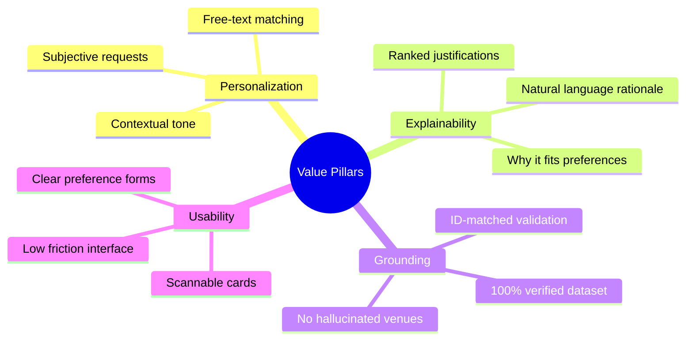
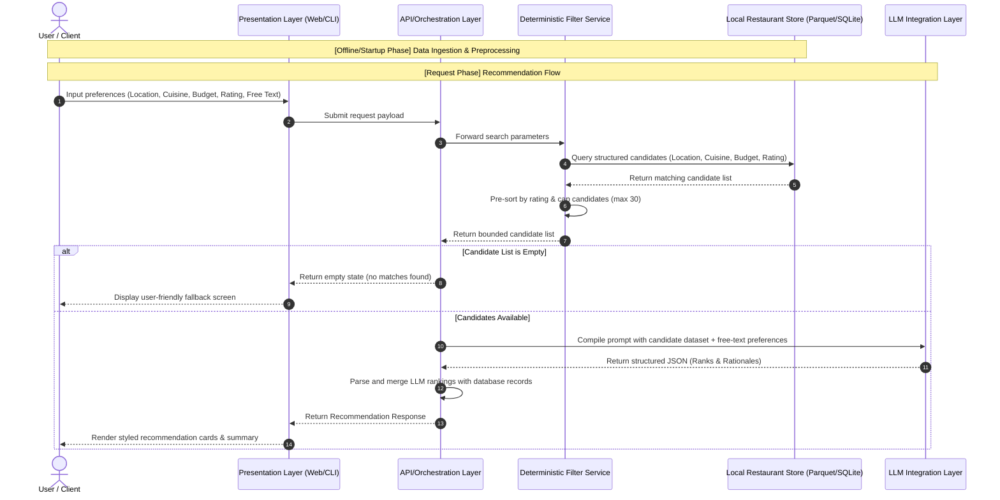

# Project Context: AI-Powered Restaurant Recommendation System (Zomato Use Case)

This document provides a comprehensive overview of the business objectives, core requirements, technical constraints, and system design philosophy for the Zomato-inspired AI-Powered Restaurant Recommendation System based on the [problemstatement.md](file:///c:/Nextleap%20Projects%20Git/ZomatoFirstProject/docs/problemstatement.md).

---

## 1. Executive Summary & Objective

Modern food platforms like Zomato handle millions of restaurants and users daily. While traditional recommendation systems rely strictly on rigid filters (e.g., star ratings, specific cuisines, budget bands), they often fail to capture the nuance of subjective user requests (e.g., *"a cozy, family-friendly spot with fast service for a birthday party"*).

The primary objective of this system is to build an **AI-powered restaurant recommendation service** that:
* Takes structured and unstructured natural-language user preferences (location, budget, cuisine, ratings, and custom free-text).
* Filters a real-world restaurant dataset deterministically to keep costs low and responses grounded.
* Integrates a Large Language Model (LLM) to intelligently rank candidates and generate personalized, human-like explanations.
* Presents the recommendations in an intuitive, premium, and highly scannable visual layout.

---

## 2. Core Value Pillars

To ensure a premium and reliable user experience, the system is designed around four key pillars:



### 🎯 Personalization
Recommendations dynamically reflect location, budget, cuisine, rating, and free-text additional preferences.

### ✍️ Explainability
Every suggested restaurant includes a custom, LLM-generated rationale explaining *why* it was selected, rather than displaying only raw fields.

### 🛡️ Grounding (Hallucination Prevention)
To maintain user trust, the system guarantees that suggested venues are real, unmodified entries from the underlying Zomato dataset. No restaurants are fabricated by the LLM.

### ⚡ Usability
The user interface features intuitive inputs and scannable output cards (comprising restaurant name, cuisine list, rating, estimated cost, and the custom AI explanation).

---

## 3. High-Level System Workflow

The application operates as a sequential pipeline, separating data preprocessing from the real-time request lifecycle to optimize latency and reliability.



---

## 4. Key Constraints & Design Principles

### 🧠 Filter-Before-Generate (Deterministic Pre-filtering)
Passing thousands of raw dataset entries directly into an LLM is impractical due to high token costs, excessive response latency, and increased risk of hallucinations. The system enforces a strict **deterministic filter** on structured criteria (Location, Budget Band, Cuisine, and Minimum Rating) before consulting the generative model.

### 📦 Bounded Context
The integration layer caps the number of candidate restaurants sent to the LLM (e.g., to the top `20–30` records, sorted by rating/votes). This keeps the token usage predictable and response times low.

### 🔐 Bounded Grounding via IDs
The prompt template includes explicit instructions forcing the LLM to choose only from the structured candidate list using unique `restaurant_id` fields. The system drops any recommendation returned by the LLM that does not map back to a verified ID in the pre-filtered candidate pool.

---

## 5. Preprocessing & Data Ingestion Specs

### 📊 Dataset Source
* **Source:** Hugging Face Dataset
* **Name:** `ManikaSaini/zomato-restaurant-recommendation`
* **URL:** [zomato-restaurant-recommendation on Hugging Face](https://huggingface.co/datasets/ManikaSaini/zomato-restaurant-recommendation)

### 🧹 Schema Normalization & Enrichment
Raw ingestion runs offline (or on application startup) to build the local repository:
1. **Deduplication & Cleaning:** Trim whitespace, strip nulls, and enforce standard casing for strings.
2. **Cuisine Parsing:** Convert raw comma-separated lists into structured string arrays.
3. **Budget Band Mapping:** Transform numerical `estimated_cost` values into three deterministic bands:
   * **Low:** `cost <= 500` (e.g., local street food, quick snacks)
   * **Medium:** `500 < cost <= 1500` (e.g., casual dining, cafes)
   * **High:** `cost > 1500` (e.g., fine dining, premium lounges)

---

## 6. Functional Architecture & Components

The application is structured into modular layers to maintain high testability and clean separation of concerns:

| Component | Responsibility | Technical Details |
| :--- | :--- | :--- |
| **Ingestion Pipeline** | Load from Hugging Face, clean, map budget bands, and serialize data. | Implemented via `loader.py` and `normalizer.py`. |
| **Restaurant Store** | High-performance read access to preprocessed restaurant data. | Backed by in-memory Parquet or SQLite in production. |
| **Filter Service** | Apply hard database filters and cap candidate lists. | Pre-sorts by rating descending to ensure high-quality LLM inputs. |
| **Prompt Builder** | Turn structured user preferences and candidate listings into a grounded system prompt. | Manages prompt versioning and templates. |
| **LLM Client** | Execute provider completions with built-in retry and fallback logic. | Abstracted client supporting OpenAI, Anthropic, or Ollama. |
| **Response Parser** | Extract structured JSON recommendations and validate ID mapping. | Implements fallback ranking if the LLM output is malformed. |
| **Orchestrator** | Handle the complete lifecycle flow from user inputs to output generation. | Clean domain facade called directly by the API or UI. |

---

## 7. Interface & API Contract Design

### Request Body Schema (`UserPreferences`)
```json
{
  "location": "Bangalore",
  "budget": "medium",
  "cuisine": "Italian",
  "min_rating": 4.0,
  "additional_preferences": "family-friendly, outdoor seating, quick service",
  "top_k": 5
}
```

### Response Body Schema (`RecommendationResponse`)
```json
{
  "summary": "Here are 5 Italian restaurants in Bangalore matching your preferences, featuring quick service and family-friendly atmospheres.",
  "recommendations": [
    {
      "rank": 1,
      "restaurant": {
        "id": "r1004",
        "name": "Toscano",
        "location": "Bangalore",
        "cuisines": ["Italian", "Salads"],
        "rating": 4.6,
        "estimated_cost": 1200.0,
        "budget_band": "medium"
      },
      "explanation": "Toscano is highly rated at 4.6 and perfectly fits your medium budget. It offers an excellent family-friendly Italian dining experience with prompt table service."
    }
  ],
  "meta": {
    "candidates_considered": 24,
    "filters_applied": ["location", "budget", "cuisine", "min_rating"]
  }
}
```

---

## 8. Failure Modes & Fault Tolerance Matrix

To ensure maximum reliability during operations, the system handles upstream errors gracefully:

| Failure Scenario | Business Impact | Engineering Mitigation Strategy |
| :--- | :--- | :--- |
| **Upstream LLM Timeout** | Long hanging loads | Enforce active timeout limits on request calls (e.g., `8` seconds). If exceeded, trigger the fallback parser instantly. |
| **Malformed JSON Response** | Server error / crash | Feed output into a regex parser to strip conversational wrappers. If parsing still fails, trigger the database-driven fallback recommendations list. |
| **Unknown `restaurant_id` returned** | Disconnected data cards | Inspect LLM outputs. Filter out any recommended ID that does not exist in the candidate list. Replace missing slots with verified database items. |
| **Rate Limits / Overloaded API** | Service unavailability | Queue repeating queries. Implement request backoffs and leverage in-memory query caching to bypass the LLM for identical query parameters. |
| **Zero Pre-Filtered Candidates** | Wasted token budget | Proactively skip LLM prompting. Instantly return a descriptive structured response: `candidates_considered: 0` and trigger a user-friendly UI suggestion. |

---

## 9. Fallback Recommendation Generator Specification

To handle all failures gracefully, the `ResponseParser` must incorporate a database-driven fallback router. If any LLM exception, timeout, or parse failure occurs, the system executes this procedure:

```python
def generate_fallback_recommendations(preferences: UserPreferences, candidates: list[Restaurant]) -> RecommendationResponse:
    # 1. Take the pre-filtered candidates (already sorted by rating descending)
    # 2. Slice the top-k requested items (default: 5)
    fallback_items = candidates[:preferences.top_k]
    
    recommendations = []
    for rank, restaurant in enumerate(fallback_items, start=1):
        # 3. Create a standardized human-like rationale explaining the recommendation
        explanation = (
            f"Selected based on its high rating of {restaurant.rating} and popular reviews in "
            f"{restaurant.location}. It matches your preferred cuisine ({restaurant.cuisine}) "
            f"and fits within your selected budget band."
        )
        recommendations.append(
            Recommendation(
                restaurant=restaurant,
                rank=rank,
                explanation=explanation
            )
        )
        
    # 4. Deliver a valid response schema to the UI, logging the fallback activation
    return RecommendationResponse(
        summary="Here are some highly recommended dining options matching your criteria.",
        recommendations=recommendations,
        meta={
            "candidates_considered": len(candidates),
            "filters_applied": ["location", "budget", "cuisine", "min_rating"],
            "fallback_mode_activated": True
        }
    )
```

---

> [!TIP]
> **Performance Tip:** 
> End-to-end response time is heavily dominated by the upstream LLM provider call. It is vital to implement a smooth loading indicator / spinner in the UI and cache repeating queries with identical filter/preference hashes to optimize costs and load speeds.

> [!IMPORTANT]
> **Grounding Safeguard:** 
> Do not assume raw Hugging Face column names are stable. The `SchemaNormalizer` must inspect the dataset's headers on the first load and explicitly map them to our internal `Restaurant` domain model.
