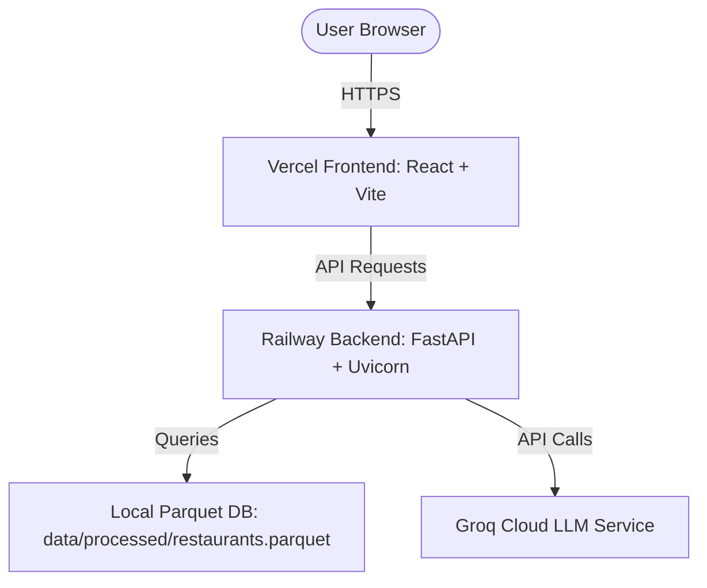

# Gastro AI Recommendation System Deployment Plan

This document outlines the step-by-step instructions to deploy the **Gastro AI Recommendation System** to production, hosting the **FastAPI Backend on Railway** and the **Vite + React Frontend on Vercel**.

---

## 🏗️ Architecture Overview

The application is split into a decoupled client-server architecture:



| Component | Platform | Primary Technologies | Deployment Source |
| :--- | :--- | :--- | :--- |
| **Backend API** | [Railway](https://railway.app) | FastAPI, Uvicorn, Python 3.11, Pandas | Root folder of the GitHub Repository |
| **Frontend UI** | [Vercel](https://vercel.com) | React, Vite, TailwindCSS, HSL Theme | `frontend` subfolder of the GitHub Repository |

---

## ⚙️ Environment Variables Reference

Ensure the following variables are configured in the respective hosting dashboards.

### Backend (Railway)
| Variable Name | Required | Default / Recommended Value | Description |
| :--- | :---: | :--- | :--- |
| `PORT` | Yes | *Automatically injected by Railway* | The port the FastAPI/Uvicorn server binds to. |
| `LLM_PROVIDER` | Yes | `groq` | The LLM provider used for recommendation synthesis. |
| `LLM_API_KEY` | Yes | *Your production Groq API Key* | API key for authenticating with Groq Cloud. |
| `LLM_MODEL` | Yes | `llama-3.1-8b-instant` | The model name used for processing user preferences. |
| `DATA_PATH` | Yes | `data/processed/restaurants.parquet` | Path to the processed restaurant Parquet database. |

### Frontend (Vercel)
| Variable Name | Required | Example Production Value | Description |
| :--- | :---: | :--- | :--- |
| `VITE_API_URL` | Yes | `https://your-backend-url.up.railway.app` | The public base URL of the deployed Railway backend (no trailing slash). |

---

## 🚀 Step-by-Step Deployment Instructions

### Step 1: Push Code to GitHub
Ensure all recent changes, including the root [.gitignore](file:///c:/Nextleap%20Projects%20Git/ZomatoFirstProject/.gitignore), [Procfile](file:///c:/Nextleap%20Projects%20Git/ZomatoFirstProject/Procfile), [Dockerfile](file:///c:/Nextleap%20Projects%20Git/ZomatoFirstProject/Dockerfile), [railway.json](file:///c:/Nextleap%20Projects%20Git/ZomatoFirstProject/railway.json), and [railway.toml](file:///c:/Nextleap%20Projects%20Git/ZomatoFirstProject/railway.toml), are pushed to your GitHub repository:
```bash
git add .
git commit -m "Configure deployment scripts and environment parameters"
git push origin main
```

> [!NOTE]
> The root `.gitignore` excludes the 574 MB raw CSV dataset (`data/raw/raw_restaurants.csv`) and the `.env` configuration files to prevent repository bloating and credential leaks.

---

### Step 2: Deploy Backend on Railway

1. **Log in to Railway**: Go to [railway.app](https://railway.app) and sign in with your GitHub account.
2. **Create a New Project**:
   - Click **New Project** in the dashboard.
   - Select **Deploy from GitHub repo**.
   - Select the repository containing your project.
3. **Automatic Build Configuration**:
   - Railway will automatically detect the [railway.json](file:///c:/Nextleap%20Projects%20Git/ZomatoFirstProject/railway.json) or [railway.toml](file:///c:/Nextleap%20Projects%20Git/ZomatoFirstProject/railway.toml) file in your root folder.
   - This file instructs Railway to use the custom [Dockerfile](file:///c:/Nextleap%20Projects%20Git/ZomatoFirstProject/Dockerfile) to build the backend.
   - The container automatically handles setting up Python, installing packages from `requirements.txt`, and launching the API server.
   - *(Note: The [Procfile](file:///c:/Nextleap%20Projects%20Git/ZomatoFirstProject/Procfile) is also kept as a fallback method for default Nixpacks builds).*
4. **Set Environment Variables**:
   - Navigate to the **Variables** tab of your service.
   - Add the following variables:
     - `LLM_PROVIDER`: `groq`
     - `LLM_API_KEY`: *(insert your production Groq API key)*
     - `LLM_MODEL`: `llama-3.1-8b-instant`
     - `DATA_PATH`: `data/processed/restaurants.parquet`
5. **Generate a Public Domain**:
   - Go to the **Settings** tab of your service.
   - Under the **Networking** section, click **Generate Domain** (or set up a custom domain).
   - Copy the generated URL (e.g., `https://web-production-xxxx.up.railway.app`). This is your **Backend URL**.
6. **Verify the Deployment**:
   - Open a browser and visit your Backend URL with the `/api/v1/health` suffix:
     `https://web-production-xxxx.up.railway.app/api/v1/health`
   - You should receive the healthy response:
     ```json
     {"status": "healthy", "service": "Gastro AI Recommendation Engine"}
     ```

---

### Step 3: Deploy Frontend on Vercel

1. **Log in to Vercel**: Go to [vercel.com](https://vercel.com) and log in with your GitHub account.
2. **Import the Project**:
   - Click **Add New** -> **Project**.
   - Import your GitHub repository.
3. **Configure Build Settings**:
   - Under **Root Directory**, click **Edit** and select the **`frontend`** directory.
   - Vercel will automatically detect **Vite** as the framework preset and preconfigure:
     - **Build Command**: `npm run build`
     - **Output Directory**: `dist`
     - **Install Command**: `npm install`
4. **Set Environment Variables**:
   - Expand the **Environment Variables** section.
   - Add the following key-value pair:
     - **Key**: `VITE_API_URL`
     - **Value**: *(Paste your public Railway URL, e.g., `https://web-production-xxxx.up.railway.app`)*
5. **Deploy**:
   - Click the **Deploy** button. Vercel will build the frontend and serve it.
   - Once the build is completed, you will receive a production deployment domain (e.g., `https://zomato-first-project.vercel.app`).

---

## 🔒 Security Best Practices

### CORS Configuration
Currently, [api_server.py](file:///c:/Nextleap%20Projects%20Git/ZomatoFirstProject/src/app/api_server.py) is configured to allow requests from any origin:
```python
app.add_middleware(
    CORSMiddleware,
    allow_origins=["*"],
    allow_credentials=True,
    allow_methods=["*"],
    allow_headers=["*"],
)
```
> [!TIP]
> For enhanced production security, it is highly recommended to restrict `allow_origins` strictly to your production Vercel domain. You can configure this dynamically via an environment variable on Railway.

---

## 🛠️ Troubleshooting

* **Frontend fails to connect to Backend (returns mock fallbacks)**:
  - Check the browser console. If you see CORS errors, verify that your backend on Railway is running and responding.
  - Verify that the Vercel variable `VITE_API_URL` is set correctly **without a trailing slash**, and that you redeployed the frontend after updating the environment variables.
* **Railway build fails with dependency errors**:
  - Ensure that the Python version matches the packages in `requirements.txt`.
  - If a package fails to build, check if you need to specify a Python version in Railway using the `NIXPACKS_PYTHON_PROVIDER` or a `runtime.txt` file (specifying e.g. `python-3.11.x`).
